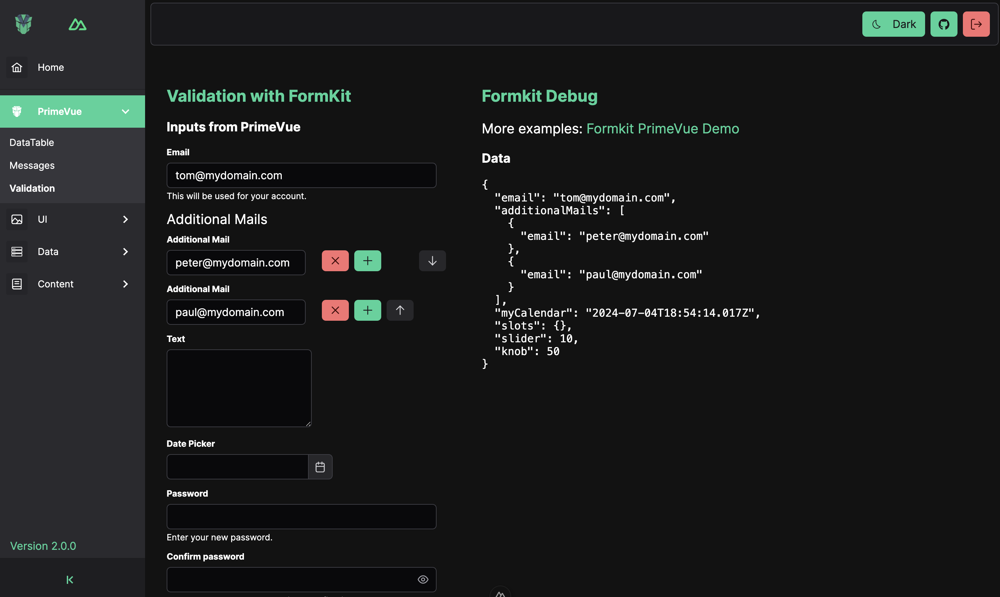

# Nuxt 3 + PrimeVue 4 Starter

Build your VUE.js App with Nuxt3 (Nuxt 4 ready). First Class PrimeVUE support. Validation by Formkit.
Based on PrimeVue Styled Theme with Aura Preset.

[](https://github.com/sfxcode/nuxt3-primevue-starter/actions/workflows/main.yml)

THX to [antfu / Vitesse Nuxt3](https://github.com/antfu/vitesse-nuxt3) for starter code

## Features

- [Nuxt 3](https://v3.nuxtjs.org) - SSR, ESR, File-based routing, components auto importing, modules, etc.
- [PrimeVue](https://primevue.org/) 4.x with Aura Theme
- [Formkit-PrimeVue](https://formkit-primevue.netlify.app/) PrimeVue Formkit Integration
- [Vite](https://vitejs.dev/) - Instant HMR
- [UnoCSS](https://github.com/antfu/unocss) - The instant on-demand atomic CSS engine.
- Use icons from any icon sets in Pure CSS, powered by [UnoCSS](https://github.com/antfu/unocss)
- [State Management via Pinia](https://pinia.esm.dev)
- [TipTap](https://tiptap.dev) - Headless Editor
- [Vitest](https://vitest.dev/) - Blazing Fast Unit Test Framework ([Getting started](https://vitest.dev/guide))
- [nuxt-test-utils](https://github.com/nuxt/test-utils) - Support for e2e and unit testing ([Getting started](https://nuxt.com/docs/getting-started/testing))

## Nuxt Modules

- [PrimeVue-Nuxt](https://primevue.org/nuxt/) PrimeVue Nuxt Module
- [Pinia](https://pinia.esm.dev/) - intuitive, type safe, light and flexible Store for Vue.
- [VueUse](https://github.com/vueuse/vueuse) - collection of useful composition APIs.
- [FormKit](https://formkit.com/) - Validation
- [UnoCSS](https://github.com/antfu/unocss) - the instant on-demand atomic CSS engine.
- [Content](https://content.nuxtjs.org) - parses .md, .yml, .csv and .json files
- [Images](https://nuxt.com/modules/images) - Optimised images for Nuxt
- [Fonts](https://nuxt.com/modules/fonts) - Plug-and-play custom web font optimization and configuration for Nuxt apps
- [I18n](https://v8.i18n.nuxtjs.org) - Integration with [Vue I18n](https://vue-i18n.intlify.dev/)

## Nuxt PrimeVue configuration

Important: use autoimport false if using primevue formkit validation

```typescript
  primevue: {
  autoImport: false,
    components: {
    exclude: ['Chart', 'Editor'],
  },
  options: {
    theme: {
      preset: Aura,
        options: {
        darkModeSelector: '.dark',
      },
    },
    ripple: true,
  },
},
```

## PrimeVue 3

Nuxt PrimeVue 3 under the [prime3](https://github.com/sfxcode/nuxt3-primevue-starter/tree/prime3) branch of this project

[Starter App on Netlify](https://vite-primevue-starter.netlify.app/)

## Project setup and usage

Install node:

**Latest node LTS version required (18)**
Use node manager like **nvm** to install.

Install pnpm:
[https://pnpm.io/installation](https://pnpm.io/installation)

Install dependencies:

```
pnpm install
```

Run development server:

```
pnpm dev
```

Vitest test runner:

```
pnpm test:unit
```

Build:

```
pnpm build
```

Start Production build:

```
pnpm start
```

## Tools

I use IntelliJ with VUE.js plugin.

## Supporters

JetBrains is supporting this open source project with:

[](http://www.jetbrains.com/idea/)


